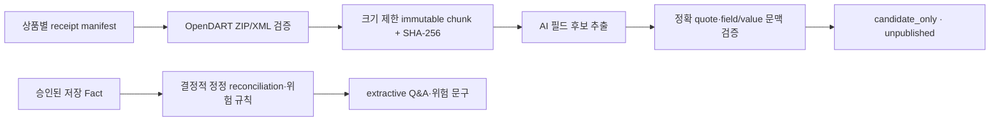

# 미술품 조각투자 AI 명세

- 문서 상태: **CURRENT · CANONICAL**
- 방법론 버전: `art-mvp-v1.0`
- 실행 모드: `AI_MODE=demo|live`

## 1. AI의 역할과 경계

AI는 자연어 검색 의도를 구조화하고, 애플리케이션이 검증한 OpenDART artifact에서 미게시 필드 후보를 추출하며, 허용된 fact block을 선택해 질문답변과 정정·위험 문구를 구성한다. AI는 Evidence 발급, 계산, 정정 승인, 위험 판정, 데이터베이스, 근거 원문을 대체하지 않는다.

- 정량 계산: TypeScript 순수 함수
- 자료·분석 저장: Repository
- 언어 이해·정성 설명: OpenAI Responses API
- 사용자 노출: 검증된 Structured Output만
- 비권유: 개인화 추천, 매수·매도, 수익 보장 금지

사용자 화면에 내부 prompt, JSON, tool log, chain-of-thought, 모델명, 키, 숨은 점수·신뢰도·확률을 노출하지 않는다.

## 2. 환경과 서버 경계

```text
OPENAI_API_KEY=...       # server only
OPENAI_MODEL=...         # 단일 설정에서 사용
AI_MODE=demo|live
```

Next.js 16 App Router의 Route Handler가 AI 호출을 소유한다.

```text
POST /api/ai/search
POST /api/ai/analyze-product
POST /api/ai/ask-product
POST /api/ai/compare
```

`OPENAI_API_KEY`를 `NEXT_PUBLIC_` 변수, Client Component, response payload, error detail, telemetry에 포함하지 않는다. 특정 모델명을 route마다 하드코딩하지 않는다. 구현 시 설치된 SDK 버전과 저장소 내 Next 16 공식 문서를 확인하고 현재 Responses API/Structured Outputs 문법을 사용한다.

## 3. OpenDART 근거 파이프라인



페이지 렌더링이나 질문마다 웹 전체를 조사하지 않는다. AI 요청에는 상품별 manifest에서 확인한 DART artifact chunk 또는 공개된 bounded fact block만 전달한다. AI 후보는 상품 원값을 변경하거나 Evidence/판정을 발급하지 않는다. 정정 계보가 검토되지 않았거나 필수 사실이 없으면 `not_assessed`를 유지한다.

### 출처 우선순위

1. 법정 공시·증권신고서·투자설명서
2. 공공기관 공식 자료
3. 발행사·플랫폼 공식 공모 문서
4. 경매사 공식 거래 기록
5. 작가·갤러리·미술관 공식 자료
6. 신뢰 가능한 제3자 자료

유료벽·로그인 제한·접근 실패 자료를 확인한 것처럼 쓰지 않는다. 핵심 값이 접근 불가이면 `missingInformationRisks`로 저장하고 판단 위험에 반영한다. 충돌은 평균 내지 않고 `conflicts`와 개별 Evidence로 보존한다.

## 4. 모델 호출 경계

현재 Responses API 호출에는 도구를 제공하지 않는다. 특히 `web_search_preview`, 파일·컴퓨터 접근, `saveEvidence`, `saveAnalysis`를 사용하지 않는다.

- `store: false`, timeout, bounded request/response, strict JSON Schema를 적용한다.
- 존재하지 않는 ID, 전체 quote 불일치, field/value 문맥 불일치, 상품/version 불일치는 출력 전체를 폐기한다.
- Q&A와 정정·위험 문구는 전체 fact block을 그대로 선택하는 extractive 모드다. 의미 entailment 검증기 없이 AI paraphrase를 공개하지 않는다.
- 저장·게시·계산·위험등급 변경은 모델 호출 경로에 없다.

## 5. 자연어 검색

### 5.1 입력/출력

예시: `최근 거래가 꾸준한 작가의 청약 중 상품`, `청산이 자주 지연된 플랫폼 상품`, `취득가와 공모가 차이가 작은 상품`.

```ts
type ParsedSearchQuery = {
  keyword?: string;
  offeringStatus?: Array<"upcoming" | "open" | "operating" | "exit_in_progress" | "liquidated">;
  verdict?: Array<"worth_considering" | "conditional" | "caution" | "danger">;
  artistNames?: string[];
  platformNames?: string[];
  premiumMin?: number;
  premiumMax?: number;
  auctionVolumeMin?: number;
  sellThroughRateMin?: number;
  delayedExitOnly?: boolean;
  sort?: "closingSoon" | "newest" | "verdict" | "premiumDesc" | "auctionVolumeDesc" | "delayRateDesc";
};
```

응답에는 `parsed`, 사용자가 볼 `chips`, 해석하지 못해 키워드로 남긴 `unresolvedTerms`를 포함한다. 값은 허용 enum/범위로 서버에서 재검증한다.

### 5.2 검색 원칙

- 명확히 해석한 조건만 적용한다. 모호한 “좋은”, “안전한”을 임의 임계값으로 바꾸지 않는다.
- “최근 3년 낙찰률이 높은” 같은 기준은 공개 방법론의 정의와 가능한 정렬로 연결한다.
- 검색 적용 조건은 제거 가능한 칩으로 노출한다.
- 원문 질의와 구조 조건을 URL에 보존한다.
- live 실패 시 demo parser를 시도하고, 미지원 질의는 일반 키워드 검색으로 처리한다. 작동하지 않는 가짜 AI UI를 표시하지 않는다.

### 5.3 demo parser 필수 예시

`AI_MODE=demo`는 최소 다음 패턴을 결정적으로 변환한다.

| 질의 의미 | 조건 |
|---|---|
| 청약 중 | `offeringStatus:["open"]` |
| 청약 예정 | `offeringStatus:["upcoming"]` |
| 공모가가 유사작보다 비쌈 | `premiumMin:0`, `sort:"premiumDesc"` |
| 청산 자주 지연 | `delayedExitOnly:true`, `sort:"delayRateDesc"` |
| 낙찰률 높음 | `sellThroughRateMin`의 공개 demo 기준 + 해당 정렬 |
| 회수 위험 큼 | `verdict:["caution","danger"]` |

정의되지 않은 숫자 임계값은 UI 문구와 함께 방법론에 공개하거나 적용하지 않는다.

## 6. 정량 계산

LLM이 아래를 암산하지 않는다.

```ts
priceGap = totalOfferingAmount - acquisitionPrice;
pricePremiumPct = priceGap / acquisitionPrice * 100;
unexplainedGap = totalOfferingAmount - acquisitionPrice - sum(disclosedCosts);
sellThroughRate = sold / (sold + unsold) * 100;
unsoldRate = unsold / (sold + unsold) * 100;
```

추가 순수 함수: 평균·중위 낙찰가, 최고가 제외 평균, 1/3/5년 거래량, 연도별 중위가, 최근 거래 공백, 실제-목표 지연, 평균 지연, 기간 내 청산률. 분모가 0이거나 필수값이 없으면 `null/result unavailable`이며 0으로 바꾸지 않는다.

취득가 `null`일 때 감정가를 대체 입력으로 쓰지 않는다. 날짜 window와 timezone, 낙찰 분모에서 `withdrawn/unknown` 제외 규칙은 방법론에 고정한다. 계산 결과는 입력 Evidence ID와 methodology version을 가진다.

## 7. 정성 분석 네 축

### 7.1 공모가격

취득가/감정가/공모금액, 구좌가격, 비용 항목, 설명 금액/미설명 차액, 취득가 대비 차이, 유사 중위값 대비 차이, 유사 범위 내 위치를 분석한다. AI는 차이가 얼마인지뿐 아니라 공개 비용으로 얼마나 설명되는지 말한다.

### 7.2 작가 시장성

1/3/5년 출품·낙찰·유찰, 낙찰/유찰률, 평균·중위·최고가 제외 평균, 분산, 연도 추이, 공백, 같은 시리즈/재료/크기, 재거래, 경매사·국가 편중을 분석한다. 작가 전체 상승과 현재 공모 작품 유동성을 구분한다.

### 7.3 회수 가능성

거래 빈도/추세, 유찰 변화, 유사 재거래, 목표 기간, 과거 실제 기간, 중도매각, 매각 주체·의사결정, 수수료·연장비용, 가격 변동, 경매사/국가 의존을 함께 본다. 거래 존재 여부만으로 “회수 가능”이라 하지 않는다.

### 7.4 발행사·플랫폼 이력

법적 발행사, 서비스 플랫폼, 공동사업자, 관리·매각 주체를 분리한다. 전체/모집/운용/매각/청산/기간 내/지연/미매각/손실, 배당, 목표/실제기간, 평균 지연, 확인기간을 분석한다.

## 8. 최종 판단

최종 판단은 AI가 아니라 `lib/art/risk/`의 결정적 규칙이 계산한다.

```ts
type DecisionStatus = "decided" | "not_assessed";
type Verdict = "worth_considering" | "conditional" | "caution" | "danger" | null;
```

필수 사실의 결측·충돌·만료, 미래 기준일, 검토되지 않은 정정 계보가 하나라도 있으면 `decisionStatus: "not_assessed"`, `verdict: null`이다. 명시적으로 근거가 연결된 가격 산술 또는 작품 식별 실패만 `danger`가 될 수 있다. 독립적으로 공시된 차액 fact가 없으면 애플리케이션이 공모가와 취득가로 같은 값을 만들어 검증에 재사용하지 않고 판정을 보류한다. 모든 rule, signal, blocker에는 accepted Fact ID와 Evidence/provenance ID가 남아야 한다.

## 9. 코멘트 작성 규칙

권장 구조:

```text
확인된 사실 → 비교 기준 → 숫자 뒤 의미 → 청약 판단 영향
```

각 핵심 분석은 실제 수치, 기간, 유사작, 전체/시리즈, 예상/실제, 목표/실제, 비용/미설명, 거래량/유찰률 중 최소 2개를 결합한다.

금지 종결:

- “추가 확인이 필요합니다.”
- “확인하는 것이 좋습니다.”
- “투자자가 직접 판단해야 합니다.”
- “전문가와 상담하세요.”
- “판단하기 어렵습니다/판정할 수 없습니다.”

예를 들어 취득가가 없으면 “취득가가 비공개입니다”에서 멈추지 않고, 공모금액이 매입가보다 얼마나 높은지 계산할 수 없고 가격 검증의 핵심 정보 비공개를 가격 위험에 반영해 어떤 verdict가 되었는지 말한다.

## 10. Structured Output

아래 `AiProductAnalysis`는 기존 저장 분석의 표시 계약이다. 현재 live OpenDART AI route는 이 객체를 생성·저장하거나 verdict를 변경하지 않고, 별도의 candidate/extractive 계약만 반환한다.

```ts
type AiProductAnalysis = {
  productId: string;
  verdict: Verdict;
  verdictLabel: "해볼 만함" | "조건부 해볼 만함" | "주의" | "위험";
  headline: string;
  summary: string;
  keyReasons: Array<{
    title: string;
    finding: string;
    implication: string;
    evidenceIds: string[];
  }>;
  priceInsight: AnalysisSection;
  artistInsight: AnalysisSection;
  exitInsight: AnalysisSection;
  platformInsight: AnalysisSection;
  missingInformationRisks: string[];
  conflicts: string[];
  updatedAt: string;
};

type AnalysisSection = {
  conclusion: string;
  quantitativeFindings: string[];
  qualitativeFindings: string[];
  evidenceIds: string[];
};
```

서버 schema 검증은 다음 불변식을 추가 확인한다.

- `productId`가 요청과 일치한다.
- verdict와 한국어 label이 정확히 매핑된다.
- 모든 이유/section에 존재하는 Evidence ID만 있다.
- 금지 verdict/score/probability 필드가 없다.
- `updatedAt`은 유효 ISO 날짜다.
- 저장되지 않은 숫자가 문장에 등장하지 않는다(가능한 범위에서 claim grounding validator).

검증 실패한 자유 텍스트를 화면에 표시하지 않는다.

## 11. 상품별 질문답변

### 요청

```ts
type AskProductRequest = {
  productId: string;
  question: string;
  analysisUpdatedAt?: string;
};
```

질문 길이/형식을 제한하고 product ID 존재를 검증한다. 저장된 Offering/Analysis/Evidence를 우선 context로 넣고 최신성 요청에서만 web tool을 허용한다.

### 응답

```ts
type AskProductResponse = {
  answer: string;
  facts: string[];
  implication: string;
  verdictImpact: string;
  evidenceIds: string[];
  usedStoredAnalysis: boolean;
  updatedAt: string;
};
```

표시 순서는 직접 답변 → 수치 → 의미 → 판단 영향 → 근거 링크다. 사용자에게 직접 조사 책임을 넘기지 않는다. 질문이 범위를 벗어나면 투자 지시를 만들지 않고 지원 가능한 상품 사실/분석으로 경계를 설명한다.

## 12. 상품 비교 분석

입력은 존재하는 2~3개 product ID다. 각 상품에 동일 방법론 버전과 비교 필드를 사용한다. 상대적으로 근거가 나은 상품을 설명할 수 있지만 `최고`, `무조건 선택`, `수익 보장`을 금지한다.

```ts
type AiComparison = {
  productIds: string[];
  headline: string;
  summary: string;
  productFindings: Array<{
    productId: string;
    finding: string;
    evidenceIds: string[];
  }>;
  caveats: string[];
  methodologyVersion: string;
};
```

## 13. 오류·재시도·fallback

| 실패 | 처리 |
|---|---|
| key 없음/live 비활성 | demo mode 또는 명시 서비스 불가; key 요구 detail 노출 금지 |
| timeout/rate limit/5xx | 제한된 지수 backoff+재시도 후 저장 최신 분석 |
| schema 불일치 | 한 번의 repair/retry 후 저장 최신 분석; 원문 텍스트 노출 금지 |
| tool 실패 | 성공 Evidence만 사용, 접근 실패를 누락 위험으로 보존 |
| Evidence ID 불일치 | 응답 폐기, 저장 분석 fallback |
| 검색 해석 실패 | demo parser → 일반 키워드 검색 |
| 질문 실패 | 저장된 분석 요약 또는 명시 오류+재시도; 페이지 전체 유지 |
| 비교 실패 | 정량 비교표는 유지하고 AI 결론 영역만 fallback |

오류 로그는 request ID, route, error category, latency만 보존하고 prompt의 민감 내용·API key·원문 전문은 남기지 않는다.

## 14. 갱신·버전·감사

- AnalysisResult는 `methodologyVersion`, input evidence version, model configuration version, `updatedAt`을 저장한다.
- 새 Evidence가 들어오면 계산 → 분석 → 검증을 다시 수행한다.
- 성공 전까지 기존 공개 분석을 유지한다.
- 변경된 주요 판단·값은 ChangeLog와 이전/새 값, 근거 ID를 남긴다.
- 방법론 버전이 다른 분석을 비교할 때 화면에 기준 차이를 표시하거나 같은 버전으로 재분석한다.

## 15. 테스트 수용 기준

- [ ] demo 예시 자연어 질의가 기대 ParsedSearchQuery와 칩으로 변환된다.
- [ ] 불명확 문구가 임의 필터가 아니라 keyword로 남는다.
- [ ] 모든 계산 edge case(null/0 denominator/date boundary)가 결정적이다.
- [ ] 네 verdict만 schema를 통과하며 label mismatch/없는 Evidence ID는 실패한다.
- [ ] 자료 부족·충돌 상품도 허용 verdict와 의미 설명을 가진다.
- [ ] 질문 답변의 모든 근거 링크가 열리고 직접답변/수치/의미/영향 구조를 가진다.
- [ ] 비교는 2~3개만 허용하며 금지 추천 문구를 만들지 않는다.
- [ ] API key가 client bundle, HTML, response, console에 없다.
- [ ] live 오류에서 저장 분석 또는 demo 규칙으로 페이지가 유지된다.
