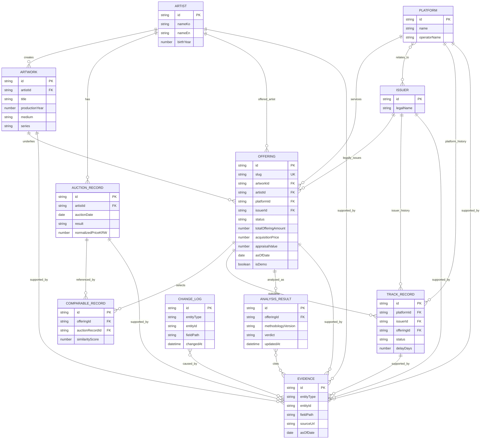
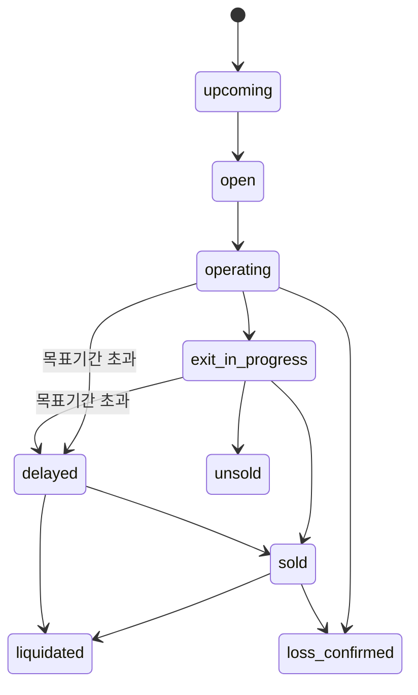

# 미술품 조각투자 데이터 모델

- 문서 상태: **CURRENT · CANONICAL**
- 방법론 버전: `art-mvp-v1.0`
- 원칙: `null`은 미확인/비공개이며 0과 다르다. 날짜는 ISO 8601, 금액 원값은 정수 KRW를 기본으로 한다.

## 1. 모델링 원칙

1. 상품(`Offering`), 실물 작품(`Artwork`), 작가(`Artist`), 플랫폼(`Platform`), 법적 발행사(`Issuer`)를 분리한다.
2. 플랫폼 브랜드·운영사·법적 발행사·관리·매각 주체가 같다고 확인된 경우에만 관계로 동일성을 표현한다.
3. 감정가와 실제 취득가는 별도 필드이며 서로 대체하지 않는다.
4. 경매 원자료(`AuctionRecord`)와 현재 작품에 대한 비교 선정(`ComparableRecord`)을 분리한다.
5. 매각 완료와 청산 완료, 기간 내와 지연 청산을 하나의 상태로 합치지 않는다.
6. 모든 핵심 사실과 분석은 `Evidence` ID를 가진다. 충돌 값은 복수 Evidence로 보존한다.
7. AI 출력은 `AnalysisResult` 구조로 검증하여 저장하고 자유 문자열 하나로 저장하지 않는다.
8. 변경은 덮어쓰기만 하지 않고 `ChangeLog`에 이전/새 값과 출처를 남긴다.
9. 데모 엔티티는 `isDemo`와 명확한 `DEMO` 이름으로 실데이터와 구분한다.

## 2. 엔티티 관계 ERD



## 3. 공통 값 객체

```ts
type DisclosedCost = {
  type: "issuance" | "platform_fee" | "storage" | "insurance" | "management" | "exit" | "other";
  label: string;
  amount: number | null;
  periodStart?: string | null;
  periodEnd?: string | null;
  sourceIds: string[];
};

type CareerRecord = {
  type: "solo_exhibition" | "group_exhibition" | "museum_collection" | "award" | "gallery" | "official_page";
  title: string;
  organization: string | null;
  date: string | null;
  url: string | null;
  sourceIds: string[];
};

type KeyReason = {
  title: string;
  finding: string;
  implication: string;
  evidenceIds: string[];
};

type AnalysisSection = {
  conclusion: string;
  quantitativeFindings: string[];
  qualitativeFindings: string[];
  evidenceIds: string[];
};
```

금액에 다중 통화가 필요하면 원 통화 금액·통화·환율·환율 기준일·정규화 KRW를 별도 필드로 저장한다. 포맷된 `1.2억원` 문자열은 모델이 아니라 presenter가 만든다.

## 4. 핵심 엔티티

### 4.1 Offering

```ts
type OfferingStatus =
  | "upcoming"
  | "open"
  | "operating"
  | "exit_in_progress"
  | "sold"
  | "liquidated"
  | "delayed"
  | "unsold"
  | "loss_confirmed";

type Offering = {
  id: string;
  slug: string;
  artworkId: string;
  artistId: string;
  platformId: string;
  issuerId: string;

  title: string;
  status: OfferingStatus;
  subscriptionStart: string | null;
  subscriptionEnd: string | null;

  unitPrice: number | null;
  minimumInvestment: number | null;
  numberOfUnits: number | null;
  totalOfferingAmount: number | null;
  acquisitionPrice: number | null;
  appraisalValue: number | null;

  targetHoldingMonths: number | null;
  actualHoldingMonths: number | null;
  distributionTerms: string | null;
  exitMethod: string | null;
  midTermTransferAvailable: boolean | null;
  exitDecisionMaker: string | null;
  assetManagerName: string | null;
  saleAgentName: string | null;

  disclosedCosts: DisclosedCost[];
  actualDistributionAmount: number | null;
  actualExitAmount: number | null;

  asOfDate: string;
  updatedAt: string;
  sourceIds: string[];
  isDemo: boolean;
};
```

`status`는 대표 현재 상태다. 상세 lifecycle event가 필요한 경우 `TrackRecord`/timeline에서 매각과 청산 날짜를 분리한다. `acquisitionPrice === null`이면 감정가를 대체 계산에 쓰지 않는다.

### 4.2 Artwork

```ts
type Artwork = {
  id: string;
  artistId: string;
  title: string;
  productionYear: number | null;
  medium: string | null;
  width: number | null;
  height: number | null;
  depth: number | null;
  edition: string | null;
  series: string | null;
  provenance: string | null;
  condition: string | null;
  imageUrl: string | null;
  sourceIds: string[];
  isDemo: boolean;
};
```

크기 기본 단위는 cm로 schema/documentation에 고정한다. 면적은 파생 계산이며 원 필드로 오인하지 않는다.

### 4.3 Artist

```ts
type Artist = {
  id: string;
  nameKo: string;
  nameEn: string | null;
  birthYear: number | null;
  deathYear: number | null;
  nationality: string | null;
  biography: string | null;
  officialCareer: CareerRecord[];
  imageUrl: string | null;
  sourceIds: string[];
  isDemo: boolean;
};
```

경력은 시장 거래와 분리해 저장·표시하며 가격상승의 직접 인과 근거로 쓰지 않는다.

### 4.4 AuctionRecord

```ts
type AuctionResult = "sold" | "unsold" | "withdrawn" | "unknown";

type AuctionRecord = {
  id: string;
  artistId: string;
  artworkTitle: string;
  auctionDate: string;
  auctionHouse: string;
  country: string | null;
  lotNumber: string | null;
  productionYear: number | null;
  medium: string | null;
  width: number | null;
  height: number | null;
  depth: number | null;
  edition: string | null;
  series: string | null;
  estimateLow: number | null;
  estimateHigh: number | null;
  hammerPrice: number | null;
  realizedPrice: number | null;
  currency: string;
  normalizedPriceKRW: number | null;
  exchangeRate: number | null;
  exchangeRateAsOf: string | null;
  result: AuctionResult;
  sourceIds: string[];
  isDemo: boolean;
};
```

낙찰가 계산에서 `hammerPrice`와 수수료 포함 `realizedPrice`를 혼용하지 않고 방법론이 선택한 필드를 기록한다. 환율 없는 외화 거래는 KRW 통계에서 제외하되 원값은 보존한다.

### 4.5 ComparableRecord

```ts
type ComparableRecord = {
  id: string;
  offeringId: string;
  auctionRecordId: string;
  sameSeries: boolean;
  sameMedium: boolean;
  similarSize: boolean;
  similarYear: boolean;
  sameEditionType: boolean | null;
  similarityScore: number;
  comparisonReason: string;
  methodologyVersion: string;
};
```

`similarityScore`는 내부 정렬 보조값이며 사용자에게 신뢰도/100점 평가처럼 표시하지 않는다. 비교 이유와 개별 기준을 화면에 제공한다.

### 4.6 Platform / Issuer

```ts
type Platform = {
  id: string;
  name: string;
  operatorName: string | null;
  website: string | null;
  issuerIds: string[];
  sourceIds: string[];
  isDemo: boolean;
};

type Issuer = {
  id: string;
  legalName: string;
  registrationNumber: string | null;
  platformIds: string[];
  sourceIds: string[];
  isDemo: boolean;
};
```

관계를 추정하지 않는다. 같은 플랫폼이 복수 발행사를 가질 수 있고 발행사도 관계가 확인된 여러 플랫폼 ID를 가질 수 있다.

### 4.7 TrackRecord

```ts
type TrackRecordStatus =
  | "offering"
  | "operating"
  | "exit_in_progress"
  | "sold"
  | "liquidated"
  | "delayed"
  | "unsold"
  | "loss_confirmed";

type TrackRecord = {
  id: string;
  platformId: string;
  issuerId: string;
  offeringId: string;
  targetHoldingMonths: number | null;
  actualHoldingMonths: number | null;
  totalDistribution: number | null;
  exitAmount: number | null;
  finalReturn: number | null;
  status: TrackRecordStatus;
  soldAt: string | null;
  liquidatedAt: string | null;
  delayDays: number | null;
  sourceIds: string[];
  isDemo: boolean;
};
```

`soldAt`과 `liquidatedAt`을 분리한다. `sold`는 청산 완료가 아니고 `liquidated`도 기간 내 완료를 뜻하지 않는다. `delayDays` 및 목표일로 기간 내 여부를 별도 파생한다. 미확인 배당·매각금액은 0이 아니다.

### 4.8 Evidence

```ts
type Evidence = {
  id: string;
  entityType: "offering" | "artwork" | "artist" | "auction_record" | "platform" | "issuer" | "track_record" | "analysis";
  entityId: string;
  fieldPath: string;
  claim: string;
  value: unknown;
  sourceTitle: string;
  sourcePublisher: string;
  sourceUrl: string | null;
  sourceType: "legal_disclosure" | "public_agency" | "issuer_official" | "platform_official" | "auction_house" | "artist_official" | "trusted_third_party";
  asOfDate: string | null;
  collectedAt: string;
  formula: string | null;
  notes: string | null;
  accessStatus: "accessed" | "paywalled" | "login_required" | "unavailable";
};
```

Evidence는 한 claim의 한 출처를 나타낸다. 충돌 원문은 같은 `entityId/fieldPath`에 복수 레코드로 남기고 AnalysisResult의 `conflicts`에서 함께 참조한다.

### 4.9 AnalysisResult

```ts
type Verdict = "worth_considering" | "conditional" | "caution" | "danger";

type AnalysisResult = {
  id: string;
  offeringId: string;
  methodologyVersion: string;
  verdict: Verdict;
  verdictLabel: "해볼 만함" | "조건부 해볼 만함" | "주의" | "위험";
  headline: string;
  summary: string;
  keyReasons: KeyReason[];
  priceInsight: AnalysisSection;
  artistInsight: AnalysisSection;
  exitInsight: AnalysisSection;
  platformInsight: AnalysisSection;
  missingInformationRisks: string[];
  conflicts: string[];
  evidenceIds: string[];
  inputEvidenceVersion: string;
  updatedAt: string;
  isDemo: boolean;
};
```

허용하지 않는 verdict, score, confidence, probability를 모델에 추가하지 않는다. 판단/한국어 label 매핑과 Evidence 존재를 schema validator가 확인한다.

### 4.10 ChangeLog

```ts
type ChangeLog = {
  id: string;
  entityType: string;
  entityId: string;
  fieldPath: string;
  previousValue: unknown;
  newValue: unknown;
  changedAt: string;
  sourceIds: string[];
};
```

금액, 기간, 상태, 주체, 판단 변경은 반드시 기록한다. 단순 새 자료 존재가 자동 위험은 아니며 실제 불리한 값/충돌이 분석에 반영됐는지를 분리한다.

## 5. 파생 지표 모델

파생값은 원본 Offering에 중복 저장하기보다 계산 결과/analysis projection으로 제공한다.

```ts
type PriceMetrics = {
  priceGap: number | null;
  premiumPct: number | null;
  disclosedCostTotal: number;
  unexplainedGap: number | null;
  comparableMedianKRW: number | null;
  comparablePremiumPct: number | null;
  evidenceIds: string[];
};

type ArtistMetrics = {
  offered: number;
  sold: number;
  unsold: number;
  sellThroughRate: number | null;
  unsoldRate: number | null;
  averagePriceKRW: number | null;
  medianPriceKRW: number | null;
  averageExcludingTopKRW: number | null;
  sameSeriesCount: number;
  latestAuctionDate: string | null;
};

type PlatformMetrics = {
  total: number;
  operating: number;
  sold: number;
  liquidated: number;
  withinTarget: number;
  delayed: number;
  unsold: number;
  lossConfirmed: number;
  averageTargetMonths: number | null;
  averageActualMonths: number | null;
  averageDelayDays: number | null;
  withinTargetRate: number | null;
};
```

분모 0은 비율 `null`; 결측을 0으로 치환하지 않는다.

## 6. 상태 전이



`delayed`는 일정 상태이고 실제 구현에서는 lifecycle 대표 상태와 `isDelayed`를 분리할 수 있다. 어느 방식이든 sold/liquidated를 잃지 않도록 한다.

## 7. Repository 계약

컴포넌트와 page가 JSON fixture를 직접 import하지 않는다.

```ts
interface ProductRepository {
  getList(query: ProductListQuery): Promise<Paginated<OfferingSummary>>;
  getById(idOrSlug: string): Promise<OfferingDetail | null>;
}
interface ArtistRepository {
  getList(query: ArtistListQuery): Promise<ArtistSummary[]>;
  getById(id: string): Promise<ArtistDetail | null>;
}
interface PlatformRepository {
  getList(query: PlatformListQuery): Promise<PlatformSummary[]>;
  getById(id: string): Promise<PlatformDetail | null>;
}
interface AnalysisRepository {
  getByOfferingId(id: string): Promise<AnalysisResult | null>;
  save(value: AnalysisResult): Promise<void>;
}
interface EvidenceRepository {
  getByIds(ids: string[]): Promise<Evidence[]>;
  getForEntity(type: string, id: string): Promise<Evidence[]>;
}
```

MVP는 `data/demo` adapter가 위 인터페이스를 구현하고 향후 DB/실데이터 adapter로 교체한다. Server Component와 Route Handler만 repository module을 호출한다.

## 8. API projection

역할 기준 API:

```text
GET /api/products
GET /api/products/:id
GET /api/artists
GET /api/artists/:id
GET /api/platforms
GET /api/platforms/:id
GET /api/methodology
POST /api/ai/search
POST /api/ai/analyze-product
POST /api/ai/ask-product
POST /api/ai/compare
```

API는 raw entity 전체가 아니라 화면별 projection을 반환해 내부 필드와 prompt/tool log가 노출되지 않게 한다. 입력은 allowlist, 출력은 schema 검증, 오류는 `{ code, message, requestId }` 형태로 통일한다.

## 9. 데모 데이터 불변식

- Offering 최소 4개, 각각 verdict 하나씩.
- 모든 이름에 `DEMO`가 명확히 들어가며 `isDemo: true`다.
- 각 작가는 최근 5년 `AuctionRecord`에 출품/낙찰/유찰을 재현할 원행이 있다.
- 각 플랫폼은 목표·실제기간, 배당, 매각일, 청산일, 지연, 최종 상태를 재현할 `TrackRecord`가 있다.
- 요구된 공모금액·취득가·비용으로 계산한 미설명 차액이 DEMO-001 100만원, 002 300만원, 003 1,800만원이고 004는 취득가 비공개로 `null`이다.
- DEMO-004 감정가를 취득가로 대체 계산하지 않는다.

## 10. 데이터 검증 규칙

- 모든 FK가 존재하고 slug/ID가 유일하다.
- `subscriptionStart <= subscriptionEnd`, `soldAt <= liquidatedAt`(둘 다 있을 때).
- 음수 단위/금액은 명시적으로 허용한 조정값이 아니면 거부한다.
- sold+unsold 분모와 raw 행 수가 지표에 일치한다.
- `numberOfUnits * unitPrice`와 공모금액 불일치는 충돌/반올림 정책으로 기록한다.
- Evidence URL은 허용 프로토콜이며 기준일/수집일을 구분한다.
- Analysis의 모든 Evidence ID가 존재하고 entity scope와 맞는다.
- demo/real 관계를 혼합하지 않는다.


## 11. 기존 DB continuity adapter (2026-08-15 구현)

`lib/art/legacy-adapter.ts`는 원본 JSON을 수정하지 않는 source adapter다. Repository는 demo와 legacy 배열을 병합하지만 다음 경계를 강제한다.

- `products.json`에서는 `category === "미술품"`인 5개만 가져온다. 공개 저장본에서 현재 lifecycle이 검증되지 않았으므로 `Offering.status="unverified"`, `isDemo=false`다.
- legacy `updatedAt`, source `collectedAt`, 중위 낙찰가가 없는 경우 `null`로 둔다. 평균·총액·기준일을 다른 의미의 값으로 대체하지 않는다.
- ArtNGuide 187건, 아트투게더 145건, TESSA 6건만 `TrackRecord`로 세며 ArtNGuide due-diligence는 동일 187건에 연결하는 enrichment다.
- history-only track에는 canonical `issuerId`/`offeringId`를 만들지 않고 `null`과 namespaced `legacySourceRef`를 사용한다.
- ArtNGuide `TRANSFER`/`RETURNED_PRODUCT`는 원문 display 규칙에 따라 `sold`, `EXPECTED_TRANSFER`는 `exit_in_progress`다. 투자자 정산이 확인되지 않아 `liquidated`로 승격하지 않는다.
- 아트투게더 `DISTRIBUTED`는 `liquidated`로 정규화하되 `isSelfReported`, raw status, 자체 게시 한계를 함께 표시한다. 통화가 없는 `quantity × pieceAmount`는 `reportedAmount`에만 보존하고 KRW formatter에 넘기지 않는다.
- TESSA는 지급일이 있는 6건을 연결하고 음수 정산수익률 3건은 `loss_confirmed`, 나머지 3건은 `liquidated`로 둔다. HKD 매각가를 임의 환산하지 않는다.
- `sourcePayload`, ArtNGuide `dueDiligencePayload`, dataset `sourceSnapshot`은 기존 원필드를 손실 없이 API repository에 연결한다. UI 지표는 검증된 normalized field만 사용한다.
- 동일 `weshareart.com` 호스트의 `투게더아트` 상품 5개와 `아트투게더` 과거 이력 145건은 명칭·법적 관계 확인 전 별도 Platform으로 유지한다.
- 실데이터 badge와 데모 badge를 분리하고 real entity에 demo 이미지/수치를 사용하지 않는다. 원본 이미지가 없으면 명시적 `원본 이미지 미저장` placeholder만 쓴다.
