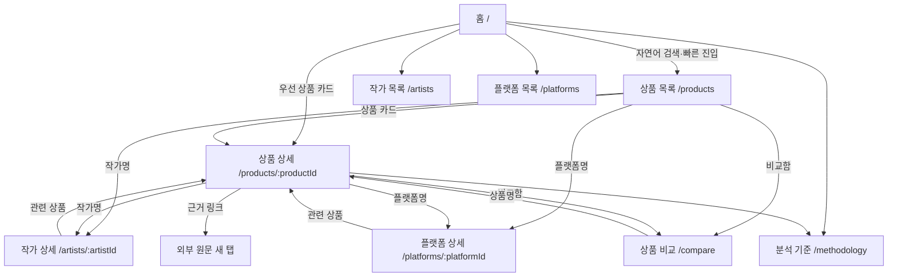
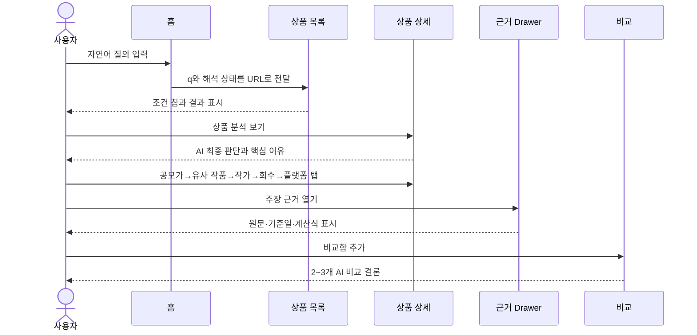

# 미술품 조각투자 서비스 정보 구조

- 문서 상태: **CURRENT · CANONICAL**
- 제품 정본: [`ART_INVESTMENT_PRODUCT_SPEC.md`](./ART_INVESTMENT_PRODUCT_SPEC.md)
- 참고 구조도: [`reference/ART_INVESTMENT_SERVICE_MAP.png`](./reference/ART_INVESTMENT_SERVICE_MAP.png)

## 1. 정보 구조 원칙

첨부 구조도에서 사이트맵, 페이지 연결, 대표 이동 흐름, 상세의 탭·토글·Drawer 방식을 참고한다. 픽셀 배치가 아니라 **한 페이지에 모든 정보를 몰지 않고 판단 → 세부 분석 → 근거로 점진 공개하는 구조**를 구현한다. 본문 요구와 이미지가 충돌하면 제품 정본을 따른다.

- `/`에서 서비스 설명과 실제 탐색을 함께 시작한다.
- 상품이 중심 엔티티이며 작가·플랫폼은 독립 탐색과 상품 복귀를 모두 지원한다.
- 상세의 현재 탭, 목록 검색·필터, 비교 대상은 URL이 상태의 정본이다.
- 장문의 출처·변경 이력은 Evidence Drawer/Accordion에서 요청할 때 노출한다.
- 모든 상세는 Breadcrumb, 교차 링크, 직접 접근, 새로고침, 404를 지원한다.

## 2. 사이트맵과 전체 라우트

```text
/
├─ /products
│  └─ /products/[productId]?tab=summary|price|comparables|artist|exit|platform|evidence
├─ /artists
│  └─ /artists/[artistId]
├─ /platforms
│  └─ /platforms/[platformId]
├─ /compare?ids=product-1,product-2[,product-3]
└─ /methodology
```

Next.js 16 App Router의 의도된 파일 매핑:

| 사용자 URL | App Router 파일 | 역할 |
|---|---|---|
| `/` | `app/page.tsx` | 설명, 자연어 검색, 빠른 진입, 우선 상품 |
| `/products` | `app/products/page.tsx` | URL 기반 검색·필터·정렬·페이지 |
| `/products/[productId]` | `app/products/[productId]/page.tsx` | 상품 헤더와 7개 분석 탭 |
| `/artists` | `app/artists/page.tsx` | 작가 검색·정렬 |
| `/artists/[artistId]` | `app/artists/[artistId]/page.tsx` | 작가 시장과 관련 상품 |
| `/platforms` | `app/platforms/page.tsx` | 플랫폼 목록·트랙레코드 요약 |
| `/platforms/[platformId]` | `app/platforms/[platformId]/page.tsx` | 운영사/발행사 관계와 이력 |
| `/compare` | `app/compare/page.tsx` | 2~3개 비교와 AI 비교 결론 |
| `/methodology` | `app/methodology/page.tsx` | 공개 분석 기준 `art-mvp-v1.0` |

잘못된 동적 ID는 `notFound()`로 `app/not-found.tsx`에 연결한다. 로딩·오류 경계는 필요한 route segment에 `loading.tsx`, `error.tsx`를 둔다.

## 3. 사이트맵 Mermaid



## 4. 글로벌 내비게이션

### 4.1 헤더

순서와 URL은 고정한다.

1. 로고 → `/`
2. 청약 상품 → `/products`
3. 작가 → `/artists`
4. 플랫폼 → `/platforms`
5. 상품 비교 `{count}` → `/compare?ids=...`
6. 분석 기준 → `/methodology`

데스크톱에서는 수평 nav, 모바일에서는 햄버거 버튼과 modal Drawer를 사용한다. 활성 상태는 정확한 pathname/segment로 계산한다. 비교 개수는 1~3일 때만 텍스트와 함께 표시한다. Drawer는 열릴 때 첫 항목에 focus, ESC/배경 클릭/닫기 버튼으로 종료, 닫힐 때 트리거로 focus를 반환한다.

### 4.2 푸터

- “미술품 조각투자 청약 전 AI 분석 서비스” 한 줄 설명
- 전체 데이터 최신 기준일
- `/methodology`와 출처 정책 anchor
- `공개 자료를 바탕으로 작성된 AI 분석이며 개인별 투자 권유는 아닙니다.`

## 5. 페이지별 정보 위계

### 홈 `/`

1. Hero 고정 문구 + 자연어 검색
2. 빠른 진입 6개
3. 청약 예정·진행 상품
4. AI가 보는 네 가지
5. 과거 청산 완료 상품
6. 서비스 원칙

### 상품 목록 `/products`

1. Breadcrumb/제목
2. 자연어 검색
3. 해석 조건 칩 + 초기화
4. 결과 수 + 정렬
5. 데스크톱 FilterPanel / 모바일 Filter Drawer
6. ProductCard 목록 또는 Empty/Error 상태
7. 페이지 이동

### 상품 상세 `/products/[productId]`

1. Breadcrumb
2. 작품/상품 헤더 + 비교함
3. 고정 탭 nav
4. 선택 탭 내용
5. 탭 내부 Evidence Drawer/Accordion
6. 관련 이동과 면책

`summary → price → comparables → artist → exit → platform → evidence` 순서다. 탭 내용은 한 번에 하나만 주요 영역으로 표시한다.

### 작가·플랫폼

목록은 요약 카드와 정렬을 제공한다. 상세는 해당 엔티티 자체 분석 → 기록 → 관련 상품 → 근거 순서다. 관련 ProductCard는 상품 상세로 복귀시킨다.

### 비교 `/compare`

선택 tray → AI 비교 결론 → 핵심 비교표 → 상품별 근거/상세 링크 순서다. 0개는 안내, 1개는 하나 더 선택하도록 안내, 2~3개는 비교를 표시한다.

### 분석 기준 `/methodology`

네 축 → 계산식 → 비교/기간 기준 → 판단 의미 → 결측·충돌 → 출처·갱신 → 버전·한계·면책 순서다.

## 6. 페이지 연결 규칙

- `ProductCard`의 카드 전체를 중첩 링크로 만들지 않는다. 상품 제목/`분석 보기`는 상품 링크, 작가명과 플랫폼명은 각각 독립 링크, 비교는 button이다.
- 상세의 작가명·플랫폼명, 작가/플랫폼 상세의 관련 상품, 비교의 상품명은 상호 연결한다.
- 모든 상세 Breadcrumb의 마지막 항목은 링크 없는 현재 페이지이며 `aria-current="page"`를 사용한다.
- 목록 → 상세 → 브라우저 뒤로가기 시 URL 상태는 자동 복원하고, Next `<Link scroll={false}>` 또는 브라우저 history를 고려해 스크롤 위치를 가능한 범위에서 유지한다.
- 외부 원문은 새 탭, `rel="noopener noreferrer"`, 출처임을 알리는 접근 가능한 이름을 사용한다.
- 존재하지 않는 ID는 빈 shell이 아니라 404와 적절한 목록 복귀 링크를 표시한다.

## 7. 대표 사용자 흐름

### 7.1 상품 중심



### 7.2 작가 중심

```text
홈/헤더 → 작가 목록 → 작가 상세 → 시장 기록·관련 청약 상품 → 상품 상세
```

### 7.3 플랫폼 중심

```text
헤더 → 플랫폼 목록 → 플랫폼 상세 → 배당·매각·청산 이력 → 관련 청약 상품 → 상품 상세
```

### 7.4 상품 비교

```text
ProductCard/상품 상세 → 비교함 추가 → /compare?ids=A,B[,C] → 상품명 → 상품 상세
```

## 8. URL 상태 관리

### 8.1 상품 검색

정규 query 계약:

```text
/products?q=&status=&verdict=&artist=&platform=&minInvestment=&premium=&sort=&page=
```

- 다중 값은 쉼표로 연결한 허용 enum만 사용한다.
- 수치는 유효 범위를 검증하며 잘못된 값은 필터에 적용하지 않는다.
- 기본값은 URL에서 생략한다. `page`는 필터 변경 시 1로 초기화한다.
- 자연어 원문 `q`는 보존하고 AI가 적용한 구조 조건도 명시 query로 직렬화한다.
- 칩 제거는 대응 query만 삭제하며 `router.replace` 또는 `<Link>`로 공유 가능한 URL을 만든다.
- AI가 해석하지 못한 텍스트는 `q`의 일반 키워드로 검색한다.

### 8.2 상세 탭

```text
/products/demo-art-001?tab=summary
```

허용하지 않은 `tab`은 `summary`로 정규화한다. 탭 링크는 실제 anchor/Link로 구현해 새 탭 열기와 키보드 사용이 가능해야 하며 `aria-current` 또는 tab pattern을 일관되게 사용한다.

### 8.3 비교

```text
/compare?ids=demo-art-001,demo-art-002,demo-art-003
```

중복·존재하지 않는 ID를 제거하고 입력 순서를 보존하며 최대 3개로 제한한다. 비교함의 UI 편의를 위한 client state가 있어도 URL이 공유·새로고침의 정본이다.

## 9. 서버/클라이언트 경계

- `page.tsx`는 `searchParams: Promise<...>`를 해석하고 Repository에서 데이터를 읽는 Server Component로 둔다.
- query 입력, 조건 칩 제거, Drawer, 비교 추가/삭제, AI 질문처럼 상태·이벤트가 필요한 부분만 `'use client'`로 둔다.
- 자연어 AI 변환은 `POST /api/ai/search`, 상품 질문은 `POST /api/ai/ask-product`, 분석/비교도 Route Handler에서 수행한다.
- Repository와 저장 분석은 서버에서 사용하고 fixture를 페이지/컴포넌트가 직접 import하지 않는다.

## 10. 구조도 대조 체크

- [ ] 시작점은 `/`이고 별도 홍보 전용 랜딩이 없다.
- [ ] 상품·작가·플랫폼 목록과 상세이 독립 URL로 존재한다.
- [ ] 카드 내부 링크 영역이 겹치지 않는다.
- [ ] 상품 상세 정보가 7개 탭으로 나뉜다.
- [ ] 작가 경력은 토글, 긴 근거는 Drawer/Accordion이다.
- [ ] 대표 네 흐름이 URL 직접 접근·뒤로가기에서도 유지된다.
- [ ] 비교는 최대 3개이고 URL에 저장된다.
