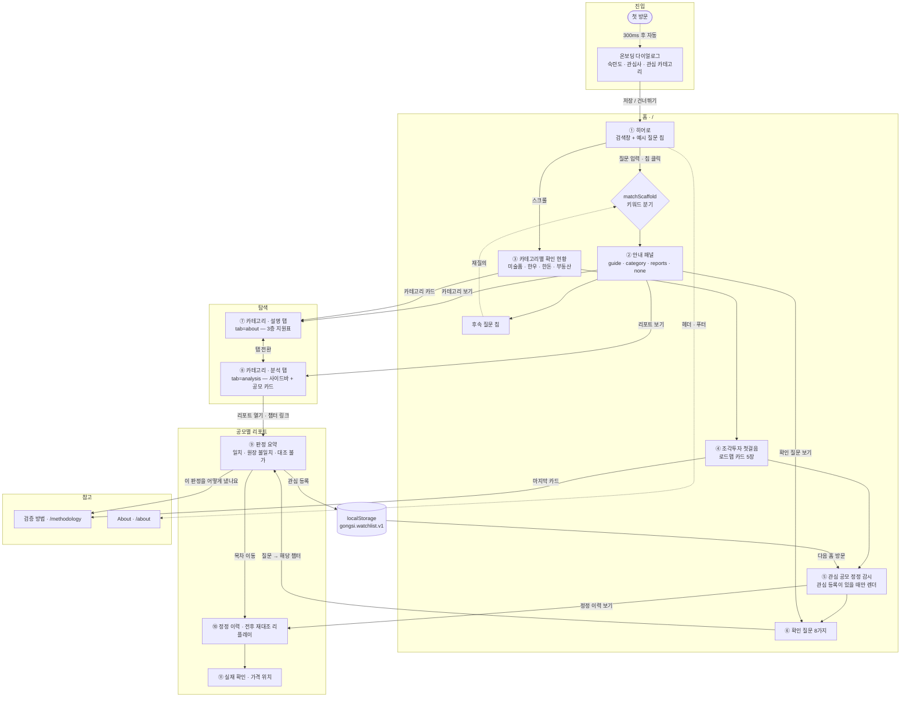
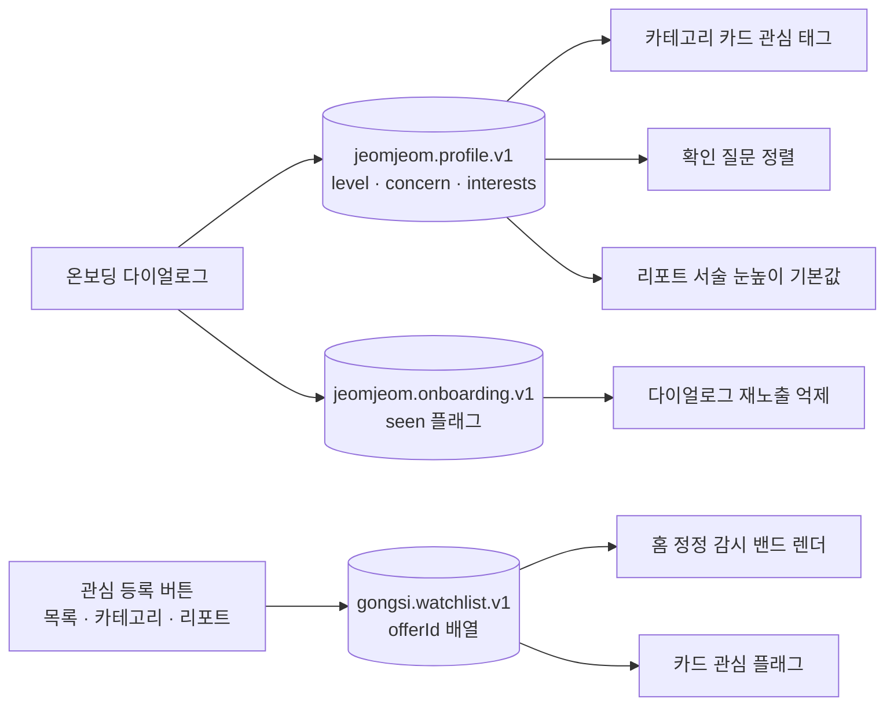
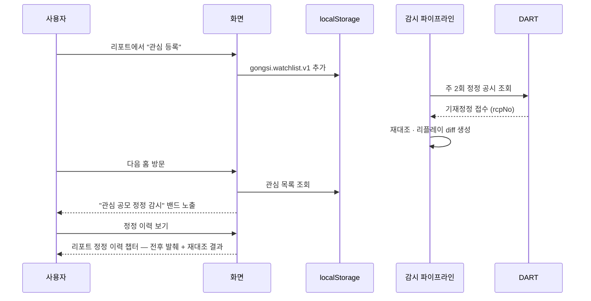

# User Flow — JeomJeom (조각투자 공시 대조 검증)

`feat/integration-user-flow` 기준. 화면 전환·분기·저장 상태를 코드에서 그대로 옮긴 문서다.
실제 실행 화면을 이어붙인 도식은 [`docs/design/userflow-screens.png`](design/userflow-screens.png) 참조.

---

## 0. 한눈에

| 축 | 내용 |
|---|---|
| 진입 | `/` 홈 — 첫 방문이면 온보딩 다이얼로그가 300ms 뒤 자동 노출 |
| 축 A (탐색) | 홈 검색 스캐폴드 → 안내 패널 → 카테고리 / 리포트로 분기 |
| 축 B (스크롤) | 홈 5구간(히어로 · 카테고리 · 첫걸음 · 정정 감시 · 확인 질문) |
| 축 C (검증) | 카테고리 분석 탭 → 공모별 리포트 상세 |
| 되돌아오는 고리 | 리포트에서 **관심 등록** → 홈 "관심 공모 정정 감시" 밴드가 켜짐 |
| 로그인 | 없음. 개인화는 전부 브라우저 `localStorage` |

서비스는 **판정 3값**만 쓴다 — `일치` · `원장 불일치` · `대조 불가`. 근거가 0건이면 판정하지 않는다.

---

## 1. 전체 흐름

---

## 2. 화면별 정의

### ① 홈 히어로 — `/`

| 항목 | 내용 |
|---|---|
| 진입 | 직접 방문, 로고 클릭(홈에서는 `jeomjeom:home-reset` 이벤트로 초기화) |
| 요소 | 3D 공시 이미지(스크롤 720px 구간에서 축소), 타이틀 분할, 검색창, 예시 질문 칩 |
| 액션 | 질문 제출 → `matchScaffold(query)` · 칩 클릭 → 해당 타깃 직행 · `×` → 검색 닫기 |
| 이동 | 검색 결과 패널(같은 화면 전환), 섹션 다이얼로 5구간 점프 |

스크롤 위치에 따라 히어로 이미지가 연속적으로 축소되고, 섹션 다이얼은 가장 가까운 구간을 표시한다.

### ② 온보딩 다이얼로그

- **자동 노출 조건**: `pathname === "/"` && `localStorage["jeomjeom.onboarding.v1"]` 없음 && 프로필 비어 있음.
- **문항 3개** — 모두 선택 해제 가능(토글):
  - 숙련도 `level`: 처음 들어요(`easy`) / 익숙해요(`pro`)
  - 관심사 `concern`: 실물이 진짜 있는지 / 돈이 어떻게 돌아오는지 / 문제 생기면 보호되는지 / 산 다음 언제 팔 수 있는지
  - 관심 카테고리 `interests[]`: 한우 · 한돈 · 미술품 · 부동산
- **재진입**: 확인 질문 섹션의 "내 확인 목록 설정" 버튼 → `ONBOARDING_OPEN_EVENT`.
- **효과**: 카테고리 카드에 관심 태그, 확인 질문 정렬 변경, 리포트 서술 눈높이 기본값.

### ③ 검색 답변 패널 (스캐폴드)

`matchScaffold`는 정규식 규칙을 순서대로 검사해 네 갈래 중 하나를 반환한다.

| 결과 | 트리거 예 | 패널 내용 | 이어지는 링크 |
|---|---|---|---|
| `category` | 한우/송아지, 돼지/한돈, 미술/그림, 부동산/상가 | 카테고리 설명 | `/cattle` 등 |
| `guide` | 예금자보호, 청약·매각·환매, 확인해야·수수료·정산, 조각투자·처음 | 첫걸음 카드 본문 + 출처 | `#checklist` |
| `reports` | 리포트, 대조 결과, 불일치, 정정, 공시가 실제와 다르 | 판정·근거 안내 | 카테고리 4종 |
| `none` | 그 외 | 안내 못 찾음 + 전체 칩 | 카테고리 4종 · `/methodology` |

패널 아래 후속 질문 칩으로 같은 화면에서 재분기한다.

### ④ 카테고리별 확인 현황 (홈 섹션)

미술품 · 한우 · 한돈 · 부동산 4카드. 관심 카테고리면 태그가 붙는다.
카드 → 카테고리 페이지.

### ⑤ 조각투자 첫걸음 (홈 섹션)

로드맵 카드 5장(첫걸음 4 + 검증 방법 1). 30초 자동 전환, 좌우 버튼·카드 클릭으로 이동.
마지막 카드 → `/methodology`.

### ⑥ 관심 공모 정정 감시 (홈 섹션)

`gongsi.watchlist.v1`에 담긴 공모만 렌더된다. 비어 있으면 섹션 자체가 없다.
행마다 정정 건수·최근 대조 시각 → `/{category}/products/{id}#report-watch-heading`.

### ⑦ 믿을만한지 확인하는 8가지 질문 (홈 섹션)

`concern`이 있으면 그 항목이 맨 위로 정렬된다. 각 항목은 아코디언으로
질문 / 왜 중요한지 / 이 서비스의 실측 / 공적 확인 경로 링크 / 최신 공모 리포트 챕터 링크를 편다.

### ⑧ 카테고리 페이지 — `/cattle` `/pig` `/art` `/real-estate`

쿼리 파라미터 2개로 상태가 결정된다.

| 파라미터 | 값 | 효과 |
|---|---|---|
| `tab` | `about`(기본) / `analysis` | 설명 탭 / 분석 워크스페이스 |
| `status` | `upcoming` / `open` / `closed` | 분석 탭의 공모 목록 필터 |

- **설명 탭**: 히어로 이미지 + 리드 + 3층(실재성 · 가격 적정성 · 이행·조건) 지원 수준 표.
  선언되지 않은 층은 "선언 대기"로 남긴다.
- **분석 탭**: 좌측 사이드바(키워드 검색 · 청약 상태 필터 · 공모 목록 · 섹션 점프) +
  본문(공모별 확인 현황 카드 → 팩트 스트립 → 정정 타임라인 → 지금까지의 대조 결과 집계 →
  발행사 트랙레코드 → 경락 시장 대조(한우) → 확인 질문).
- **카테고리 특화 슬롯**: 한돈은 공시 축 정리(회차·가격·질병 맥락), 미술품은 공모 5건 공시 원문 대조.

### ⑨ 리포트 상세 — `/{category}/products/{id}`

목차: **요약 → 신고서 정보 → 정정 이력 → 이행 이력 → 실재 확인 → 가격 위치**
(신고서 정보는 팩트가 있을 때만 노출)

| 블록 | 내용 |
|---|---|
| 판정 요약 | 일치 / 원장 불일치 / 대조 불가 3값 + 확인된 사실 · AI 해석 서술 |
| 눈높이 토글 | `easy` ↔ `pro`. 기본값은 온보딩 `level`, 화면에서 덮어쓸 수 있음 |
| 생애주기 스트립 | 청약 일정과 현재 위치 |
| 정정 이력 | 정정 전후 발췌 diff, 재대조 결과, 감시 상태 |
| 이행 이력 | 발행사 트랙레코드 |
| 실재 확인 | 개체 단위 대조 매트릭스(부록 위계) |
| 가격 위치 | 경락가·실거래가 대비 위치 |

카테고리별 `generateStaticParams` + `dynamicParams = false` — 다른 카테고리나 등록되지 않은 id는 404.

### ⑪ 검증 방법 — `/methodology` / ⑫ About — `/about`

`/methodology`는 대조 4단계·판정 어휘·한계를 설명하고, 리포트의 "이 판정을 어떻게 냈나요"가 여기로 온다.
`/about`은 배경 · 판정 3값 정의 · 데이터 출처 · 팀을 담는다.

---

## 3. 저장되는 상태 (로그인 없음)

세 키 모두 브라우저에만 남는다. 서버로 보내지 않는다.

---

## 4. 정정 감시 고리

공시가 정정되면 홈으로 되돌아오는 고리가 이 서비스의 핵심 동선이다.

---

## 5. 라우트 대조표

| 경로 | 화면 | 렌더 |
|---|---|---|
| `/` | 입문자 홈 (5구간) | 서버 + 클라이언트 상태 |
| `/cattle` `/pig` `/art` `/real-estate` | 카테고리 착지 (설명 / 분석) | 서버, `tab`·`status` 쿼리 |
| `/{category}/products/{id}` | 카테고리별 리포트 상세 | 정적 생성, 타 카테고리·미등록 id 404 |
| `/methodology` | 검증 방법 | 정적 |
| `/about` | 소개 · 팀 | 정적 |
| `POST /api/verify/{id}` | 라이브 재검증 | 실패 시 `mode:"snapshot"` 폴백 |
| `GET /api/cron/monitor` | 정정 감시 | vercel.json cron 주 2회 |
| `GET /api/products`(·`/{id}`) | 미술 공개 상품 문맥 | 파일 원천, 08 예외 4분류 |
| `POST /api/ai/ask-product` | 미술 근거 코파일럿 | 한시 표면 — search 개통 시 통합(08 예외 5분류) |

화면은 사전 생성된 `data/public/{offerId}/report-*.json`만 읽는다 — 렌더 경로에서 외부 API를 직접 호출하지 않는다.

---

## 6. 막다른 길 처리

| 상황 | 화면이 하는 일 |
|---|---|
| 검색어가 규칙에 안 걸림 | "안내를 찾지 못했습니다" + 전체 카테고리·리포트·방법 칩 |
| 관심 등록이 하나도 없음 | 홈 정정 감시 밴드를 아예 렌더하지 않음 |
| 상태 필터에 해당 공모 없음 | "선택한 청약 상태에 해당하는 공모가 없습니다" |
| 카테고리에 공개 리포트 없음 | preview 목록 또는 "아직 공개 리포트가 없습니다" |
| 대조할 공공 데이터가 없음 | 추정하지 않고 **대조 불가**로 표기 |
| 등록되지 않은 공모 id | 404 |

## 2026-09-05 통합 흐름

홈 검색 또는 카테고리 선택 → 상태·검색어 필터 → 카테고리별 상품 상세 → 탭에서 조건·근거 확인 → 분석 목록으로 돌아가기.
부동산 시나리오는 관심 등록 후 관심 공모 목록에서도 다시 열 수 있다. 실제 공시 감시 대상과는 구분해 표시한다.
미술품의 이전 `?product=` 링크는 상품 상세로 이동한다. 일반 지식 검색과 상품 범위 질문은 각각 홈과 상세에 둔다.
